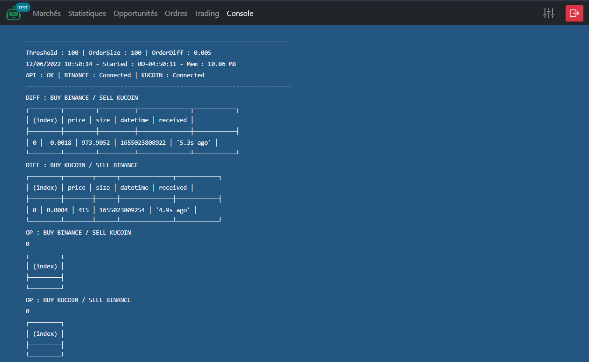

# obot-sf-backend

### oBot Symfony backend and dashboard
     


### Modules
- [obot-arbitrage-server](https://github.com/Olivier-Go/obot-arbitrage-server)
- [obot-datafeed-server](https://github.com/Olivier-Go/obot-datafeed-server)

### Install Project dependencies :
```
```sh
composer install
yarn install
```

### Generate JWT SSL keys:
```sh
php bin/console lexik:jwt:generate-keypair --skip-if-exists
```

Your keys will land in `config/jwt/private.pem` and `config/jwt/public.pem` (unless you configured a different path)

### Create database :
```sh
bin/console doctrine:database:create
# or
bin/console d:d:c
```

### Database migration :
```sh
bin/console doctrine:migrations:migrate
# or
bin/console d:m:m
```

### Start Mercure Hub :
```sh
docker-compose up
```

### Restart node arbitrage server (every 6 hours) :
```sh
# create symbolic link to symfony command (root)
ln -s /<...>/obot-sf-backend/bin/console /usr/local/bin/obot-sf-backend

# crontab -e
0 */6 * * * obot-sf-backend app:node-ws --cmd=restart
```